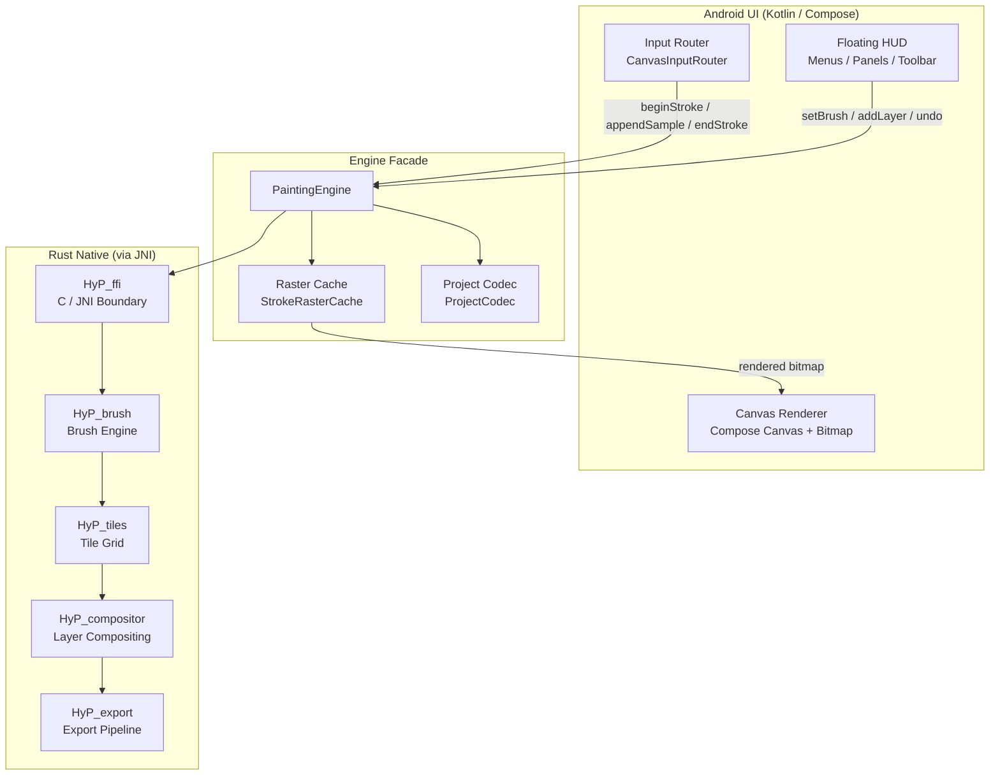
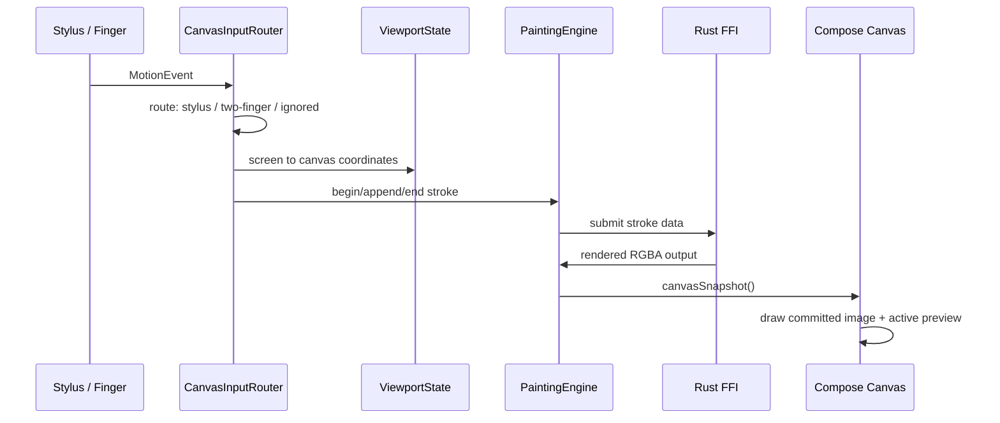

# HyPainter

> An open-source Android tablet drawing application. Modern experience, open-source implementation.

---

## Overview

**HyPainter** is a drawing application designed for Android tablets with stylus support. It delivers a low-latency, pressure-sensitive painting experience that scales from quick sketches to complex multi-layer illustrations.

### Key Differentiators

- **Rust stroke backend** — Brush rasterization and tile compositing run in Rust via JNI, not on the Java heap.
- **Pressure and tilt support** — Full stylus pressure and tilt capture with real-time stroke preview.
- **Two-finger gesture canvas** — Pan, zoom, and rotation with centroid anchoring.
- **Floating HUD** — Tool panels, color picker, and layer inspector float over the canvas without taking fixed screen estate.
- **Animations and feedback** — Panel fade in/out, cross-panel AnimatedContent transitions, gesture toast showing zoom and rotation.

---

## Features

### Drawing
- Stylus-priority input with pressure and tilt support (stylus only for now)
- Undo and clear
- Brush color and size controls

### Canvas
- Two-finger pan, zoom, and rotation with centroid anchoring
- Gesture toast showing zoom percentage and rotation angle
- Pixel-perfect and multiple bitmap sampling modes

### Layers
- Add, select, toggle visibility
- Scrollable layer list

### UI / UX
- Floating left tool HUD (brush quick-select, opacity, size)
- Right-side floating panels (Brush, Layers, Color)
- Animated panel transitions
- Menu panel: New Canvas, Save/Load Draft, Export/Share PNG, Reset View
- Navigation bar auto-hidden for immersive drawing (WIP)

### File I/O
- App-private draft project save/load
- PNG export and Android share sheet
- New Canvas dialog with custom size and screen-size preset

### Rendering
- Rust native engine for committed strokes
- Kotlin fallback engine for development
- Active stroke raster cache for responsive preview

---

## Architecture



### Data Flow



### Module Responsibilities

| Module | Responsibility |
|--------|---------------|
| `MainActivity` | CanvasScreen, viewport, project state, HUD shell |
| `ui/HudComponents` | Floating panels, toolbar, sliders, icons |
| `CanvasViewport` | Pan/scale/rotation, coordinate mapping |
| `input/CanvasInputRouter` | MotionEvent routing, gesture detection |
| `engine/PaintingEngine` | Engine facade — layers, strokes, snapshot |
| `engine/KotlinPaintingEngine` | JVM fallback implementation |
| `engine/NativePaintingEngine` | Rust native wrapper |
| `rust/HyP_*` | Brush, tiles, compositor, export, FFI |

---

## Building

### Prerequisites

- Android Studio (or command-line build tools)
- Rust toolchain: `rustup target add aarch64-linux-android`
- Android NDK (set `ANDROID_NDK_HOME`)

### Commands

```powershell
# Rust checks
cd rust
cargo fmt --all -- --check
cargo test

# Build debug APK (includes Rust .so)
cd ..
.\gradlew :android:app:assembleDebug

# Install on device
.\gradlew :android:app:installDebug
```

| Variant | Rust build | Signing | Use case |
|---------|-----------|---------|----------|
| `debug` | `cargo build` | Debug keystore | Daily development |
| `release` | `cargo build --release` | Configurable keystore | Preview distribution |

---

## Roadmap

### MVP (current — ≈80%)

Core drawing loop, basic layers, floating HUD, file I/O.

### Phase 1 — Polish & Performance
- [ ] Real file picker for save/load
- [x] Canvas auto-center and auto-fit
- [ ] Tile / dirty-rect incremental refresh
- [ ] Stylus stabilization and stroke smoothing
- [ ] Performance gates

### Phase 2 — Product Features
- [ ] Brush library (texture and presets)
- [ ] Eraser, opacity, blend modes
- [ ] Full layer controls (opacity, blending, grouping)
- [ ] Color wheel and palette management

### Phase 3 — Advanced
- [ ] Versioned .pdraw container format
- [ ] Layer compositing in Rust
- [ ] Multi-threaded tile rendering
- [ ] Export to PSD / PDF

---

## Milestones

| Milestone | Target | Status |
|-----------|--------|--------|
| Demo-able drawing loop | 2026 Q1 | ✅ |
| Floating HUD + panels | 2026 Q2 | ✅ |
| Animated UI + gesture toast | 2026 Q2 | ✅ |
| Canvas auto-fit + center | 2026 Q2 | ✅ |
| Preview release | 2026 Q3 | 🚧 |
| Layer compositing in Rust | 2026 Q3 | 📝 |
| Brush library + texture | 2026 Q4 | 📝 |

---

## Documents

| File | Description |
|------|-------------|
| `README.zh-CN.md` | Chinese version of this README |
| `docs/foundation-design.md` | Product and technical foundation design |
| `docs/current-architecture.md` | Module map, data flow, responsibility boundaries |
| `docs/mvp-status.md` | MVP completeness, verified commands, remaining work |
| `docs/device-input-test-plan.md` | Stylus and touch verification plan |
| `docs/android-studio-debugging.md` | Debug build and Logcat notes |

---

*Last updated: 2026-07-07*
