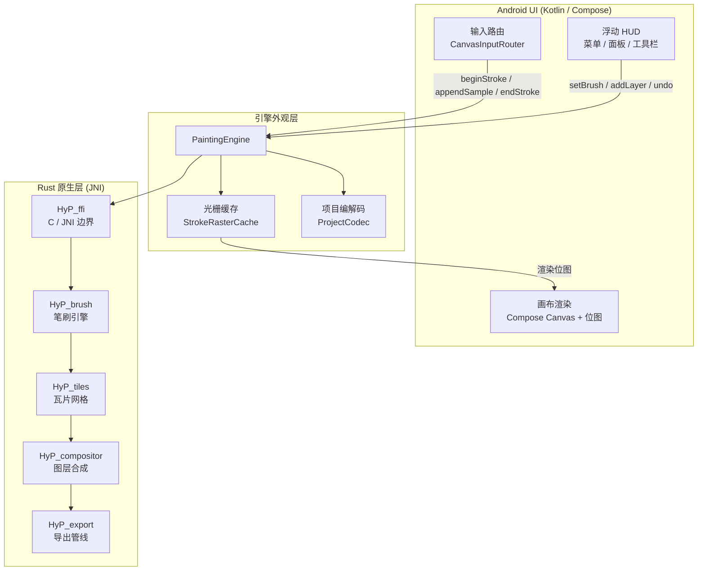
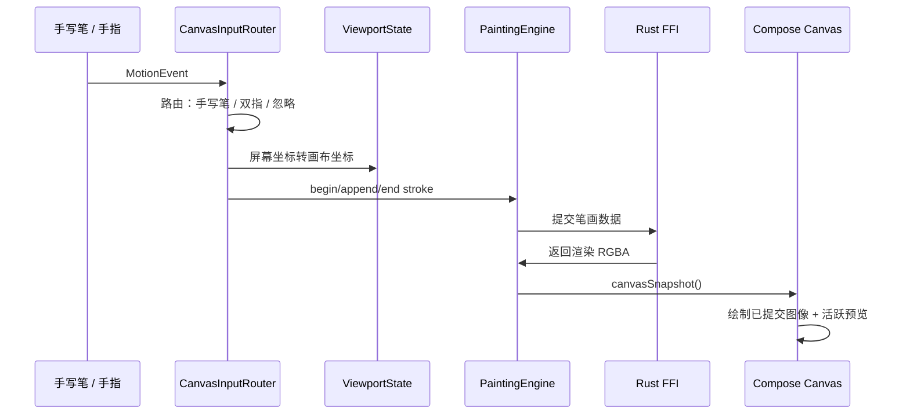

# HyPainter

> 一款面向安卓平板的开源绘画应用，现代体验，开源实现。

---

## 概述

**HyPainter** 是一款面向安卓平板和压感笔用户的绘画应用。目标是在移动端提供低延迟、高响应、支持压力感和倾斜感的绘画体验，从快速草图到复杂多层插画均可胜任。

### 核心优势

- **Rust Stroke后端** — 笔刷光栅化和瓦片合成通过 JNI 在 Rust 中执行，不占用 Java 堆。
- **压感与倾斜支持** — 完整捕获手写笔压力与倾斜角度，实时笔画预览。
- **双指手势画布** — 双指平移、缩放和旋转。
- **浮动 HUD** — 工具面板、颜色选择器、图层检查器浮动于画布之上，不占用固定屏幕区域。
- **动画与反馈** — 面板淡入淡出、跨面板 AnimatedContent 过渡、手势吐司显示缩放和旋转角度。

---

## 功能

### 绘画
- 手写笔优先输入，支持压感和倾斜（当前仅支持手写笔）
- 撤销和清除
- 画笔颜色和大小

### 画布
- 双指平移、缩放、旋转，质心锚定
- 手势吐司实时显示缩放百分比和旋转角度
- Perfect像素及多种位图采样模式

### 图层
- 添加、选中、切换可见性
- 可滚动图层列表

### 界面
- 左侧浮动工具 HUD（快速选笔、不透明度、大小）
- 右侧浮动面板（画笔、图层、颜色）
- 面板动画过渡
- 菜单面板：新建画布、保存/读取草稿、导出/分享 PNG、重置视图
- 导航栏自动隐藏，沉浸画布体验（WIP）

### 文件
- 应用私有草稿项目保存/读取
- PNG 导出和系统分享
- 新建画布对话框支持自定义尺寸和屏幕尺寸预设

### 渲染
- Rust 原生引擎处理已提交笔画
- Kotlin 备选引擎用于开发调试
- 活跃笔画光栅缓存，保证预览响应

---

## 架构



### 数据流



### 模块职责

| 模块 | 职责 |
|------|------|
| `MainActivity` | CanvasScreen、视口、项目状态、HUD 外壳 |
| `ui/HudComponents` | 浮动面板、工具栏、滑块、图标 |
| `CanvasViewport` | 平移/缩放/旋转计算、坐标映射 |
| `input/CanvasInputRouter` | MotionEvent 路由、手势识别 |
| `engine/PaintingEngine` | 引擎外观 — 图层、笔画、快照 |
| `engine/KotlinPaintingEngine` | JVM 备选实现 |
| `engine/NativePaintingEngine` | Rust 原生封装 |
| `rust/HyP_*` | 笔刷、瓦片、合成器、导出、FFI |

---

## 构建

### 前置条件

- Android Studio（或命令行工具）
- Rust 工具链：`rustup target add aarch64-linux-android`
- Android NDK（设置 `ANDROID_NDK_HOME`）

### 命令

```powershell
# Rust 检查
cd rust
cargo fmt --all -- --check
cargo test

# 构建 Debug APK（包含 Rust 原生 .so）
cd ..
.\gradlew :android:app:assembleDebug

# 安装到设备
.\gradlew :android:app:installDebug
```

| 变体 | Rust 编译 | 签名 | 用途 |
|------|-----------|------|------|
| `debug` | `cargo build` | Debug 密钥 | 日常开发 |
| `release` | `cargo build --release` | 可配置密钥 | 预览版分发 |

---

## 路线图

### MVP（当前 — ≈80%）

核心绘画循环、基础图层、浮动 HUD、文件读写。

### 第一阶段 — 打磨与性能
- [ ] 正式文件选择器
- [x] 画布自动居中与自适应
- [ ] 瓦片/脏矩形增量刷新
- [ ] 手写笔稳定和笔画平滑
- [ ] 性能门禁

### 第二阶段 — 产品功能
- [ ] 笔刷库（纹理和预设）
- [ ] 橡皮擦、不透明度、混合模式
- [ ] 完整图层控制（不透明度、混合、分组）
- [ ] 色轮和调色板管理

### 第三阶段 — 高级
- [ ] 版本化 .pdraw 容器格式
- [ ] Rust 端图层合成
- [ ] 多线程瓦片渲染
- [ ] 导出为 PSD/PDF

---

## 里程碑

| 里程碑 | 目标 | 状态 |
|--------|------|------|
| 可演示绘画循环 | 2026 Q1 | ✅ |
| 浮动 HUD + 面板 | 2026 Q2 | ✅ |
| 动画 UI + 手势吐司 | 2026 Q2 | ✅ |
| 画布自适应 + 居中 | 2026 Q2 | ✅ |
| 预览版发布 | 2026 Q3 | 🚧 |
| Rust 端图层合成 | 2026 Q3 | 📝 |
| 笔刷库 + 纹理 | 2026 Q4 | 📝 |

---

## 文档

| 文件 | 说明 |
|------|------|
| `README.md` | 本自述文件的英文版 |
| `docs/foundation-design.md` | 产品与技术奠基设计方案 |
| `docs/current-architecture.md` | 模块地图、数据流、职责边界 |
| `docs/mvp-status.md` | MVP 完成度、已验证命令、剩余工作 |
| `docs/device-input-test-plan.md` | 真实设备手写笔和触摸验证计划 |
| `docs/android-studio-debugging.md` | Debug 构建和 Logcat 调试笔记 |

---

*最后更新：2026-07-07*
