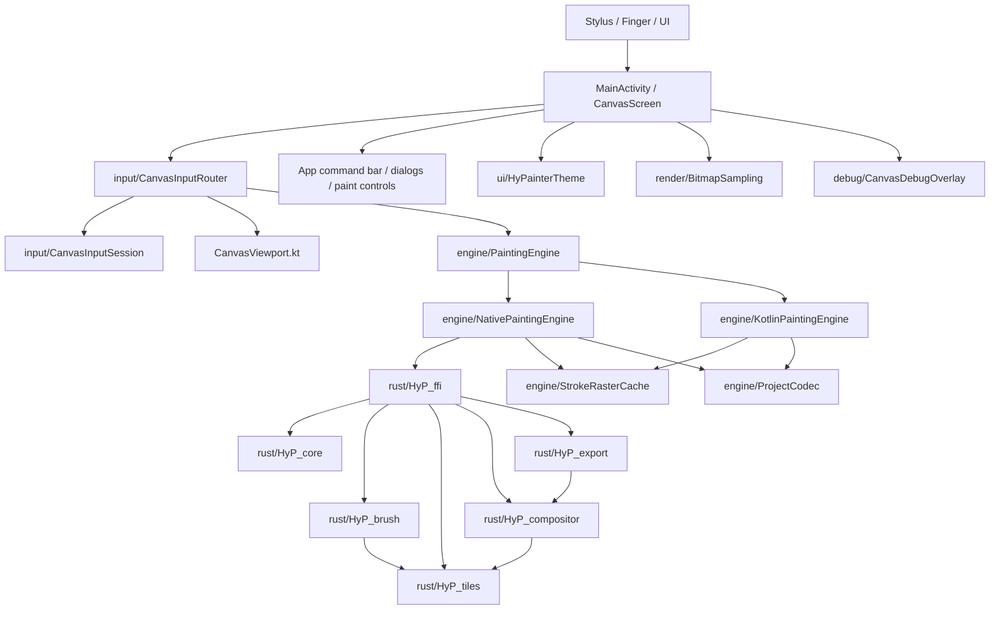
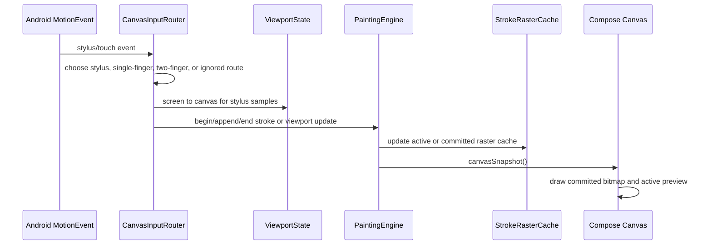
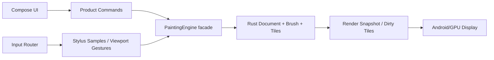

# Current Architecture and Responsibility Map

本文总结 HyPainter 当前代码结构、模块职责、已完成的 MVP 基础进展，以及下一阶段应保持的边界。它不是最终架构蓝图；最终方向仍以 `foundation-design.md` 为准。本文更像当前工程地图，用来帮助后续重构时知道哪些代码属于临时验证，哪些边界已经值得保留。

## Design Principle

HyPainter 的长期目标是现代安卓平板板绘应用。当前最重要的工程原则是：高频绘制链路必须清晰、低分配、低耦合。

核心模块应该逐步收敛为高内聚封装：

- Engine 负责文档、笔画、图层、缓存、保存、导出和渲染快照，不把内部数据结构泄漏给 UI。
- Input 负责 MotionEvent 分层、优先级和坐标转换，不直接持有产品状态。
- Viewport 负责屏幕空间和画布空间转换，不理解笔刷或图层。
- UI 负责展示和命令触发，不承担笔刷栅格化或文档一致性。
- Debug 负责观察，不应改变输入状态或增加绘制路径粘性。

## Structure Diagram

## Runtime Data Flow

## Android Modules

### `MainActivity.kt`

Current role:

- Hosts the Compose painting screen.
- Owns top-level UI state: document title, viewport, pressure, command status, debug overlay, render options, wallpaper color toggle, and project/export status.
- Connects `CanvasInputRouter` to `PaintingEngine`.
- Draws cached committed image plus active stroke preview.
- Provides the current HUD shell: floating `File`, `Canvas`, and `View` menus, left quick tools, bottom status chip, and right-side floating Brush/Layers/Color inspector panels.
- Keeps command UI as small floating surfaces over the drawing stage rather than fixed bars around the canvas.

Boundary to preserve:

- It may coordinate modules, but should not grow into the document model.
- It should not manually manipulate stroke internals.
- The current HUD shell should eventually split into dedicated UI components and a product command layer.

### `ui/HyPainterTheme.kt`

Current role:

- Provides the Compose `MaterialTheme` wrapper for the Android app shell.
- Uses Android 12+ Material You dynamic color schemes when the user enables `Wallpaper Colors`.
- Falls back to fixed HyPainter light/dark color schemes on older Android versions or when wallpaper colors are disabled.

Boundary to preserve:

- Theme colors affect UI chrome and Material controls only.
- Canvas pixels, brush colors, exports, and project data must not change because the UI theme changes.

### `ui/HudComponents.kt` and `ui/LucideIcons.kt`

Current role:

- Defines the floating tablet drawing HUD outside `MainActivity`.
- Left HUD follows the sketch order: brush library, three quick brush buttons, opacity slider, and size slider.
- Right-top toolbar follows the sketch order: menu, selection, transform, tool, color, and layers.
- `LucideIcons.kt` provides a small local Lucide-style icon subset so HUD iteration is not blocked by external design-kit or icon-library availability.

Boundary to preserve:

- HUD components issue product-level callbacks and engine commands; they should not own document truth.
- Placeholder controls should remain visible but clearly route through callbacks until the engine protocol supports them.

### `CanvasViewport.kt`

Current role:

- Defines `ViewportState(pan, scale, rotation)`.
- Converts screen coordinates to canvas coordinates and back.
- Implements two-finger transform anchoring around the previous centroid's canvas point.

Why it matters:

- Correct mapping is the basis for full-screen drawing, rotated canvas drawing, and non-centered two-finger rotation.
- Tests already cover pan, scale, rotation round trip and centroid anchoring.

Boundary to preserve:

- Viewport should stay math-only.
- It should not depend on Android `MotionEvent`, engine, brush, or UI state.

### `input/CanvasInputRouter.kt`

Current role:

- Converts Android `MotionEvent` into engine or viewport actions.
- Gives stylus and eraser priority over touch.
- Recovers stylus pointer from MOVE events when the action index is not stylus.
- Uses historical samples for smoother active stroke updates.
- Routes two-finger touch to viewport transform.
- Publishes optional debug state and throttled Logcat lines.

Important current behavior:

- Stylus input consumes the stream and does not participate in pan/zoom/rotate.
- If stylus MOVE appears after a missed/consumed DOWN, the router now explicitly starts a stroke from the earliest available historical sample.
- Debug active pointer lookup is now side-effect free.

Boundary to preserve:

- Router can know about Android events and routing policy.
- Router should not implement brush logic.
- Router should avoid allocations on every sample where possible.

### `input/CanvasInputSession.kt`

Current role:

- Stores priority state for active stylus and finger streams.
- Clears finger gesture state when stylus begins.
- Prevents residual touch after stylus input from immediately taking over viewport movement.
- Stores the last two-finger frame for incremental transform.

Important current behavior:

- Two-finger transform requires a valid finger stream that began from a fresh finger down.
- Stylus ending releases stylus priority, but does not resurrect old finger gesture state.

Boundary to preserve:

- Session should stay deterministic and JVM-testable.
- It should not depend on `MotionEvent` or the engine.

### `engine/PaintingEngine.kt`

Current role:

- Defines the high-level engine interface used by UI/input.
- Provides `EngineSample`, `EngineStroke`, `EngineLayer`, `EngineBrush`, and `EngineSnapshot`.
- Exposes a single creation function that prefers native Rust engine and falls back to Kotlin.

Architectural intent:

`PaintingEngine` should become the main high-cohesion facade. The UI should be able to say "begin stroke", "append sample", "end stroke", "undo", "set brush", "snapshot", "save", and "export" without knowing whether the backing implementation is Rust, Kotlin, tiled, GPU-backed, or cached.

Boundary to preserve:

- Keep commands coarse-grained and product-level.
- Avoid exposing mutable internals.
- Do not let UI own committed stroke history long term.

### `engine/KotlinPaintingEngine.kt`

Current role:

- JVM/Kotlin fallback implementation.
- Maintains committed strokes, active stroke, MVP layers, brush state, and raster caches.
- Updates an active preview cache while drawing.
- Merges active cache into display cache on stroke end.
- Saves/loads current draft project format.

Status:

- Useful for fallback and fast iteration.
- Not the final source of truth for professional brush behavior.

Boundary to preserve:

- Keep it compatible with `PaintingEngine`.
- Avoid adding features here that cannot later move behind the Rust engine facade.

### `engine/NativePaintingEngine.kt`

Current role:

- Loads `libhyp_ffi.so` when available.
- Uses Kotlin preview/cache path for immediate active stroke feedback.
- Keeps committed strokes on Android side for MVP layers and project save/load.
- Rebuilds Rust document lazily for export/render when needed.

Status:

- Native is integrated and packaged for debug arm64.
- Rust currently renders committed document output, while Android still owns several MVP semantic layers.

Boundary to improve:

- Long term, document model, layer compositing, undo, and file format should move deeper into Rust.
- Android should send batches and receive renderable outputs, not replay document semantics forever.

### `engine/StrokeRasterCache.kt`

Current role:

- Maintains Android-side bitmap caches for committed strokes and active preview.
- Allows Compose to draw bitmaps instead of replaying every stroke each frame.

Why it matters:

- This is the current performance hinge for "real-time rendering while drawing".
- It avoids large main-thread replay cost during continuous drawing and undo.

Boundary to improve:

- This is a pragmatic MVP bridge.
- Future tile/dirty-rect cache should live under the engine, preferably Rust-first with GPU/display integration later.

### `engine/ProjectCodec.kt`

Current role:

- Saves and loads an app-private draft text format.
- Covers canvas size, layers, active layer, brush, and stroke samples.

Status:

- Good enough for MVP testing.
- Not the future `.pdraw` container.

### `render/BitmapSampling.kt`

Current role:

- Defines bitmap sampling modes.
- Defaults to `PixelPerfect`, mapped to `FilterQuality.None`.

Status:

- Current default matches the requirement for pixel-perfect rendering.
- UI selection for sampling modes is exposed through the `View` menu and canvas settings dialog.

### `debug/*`

Current role:

- Defines input debug state, formatting, overlay UI, and Logcat tag/interval.
- Shows route, action, tool, pointer id, active stylus id, sample counts, event timing, viewport, heap, and handling duration.

Boundary to preserve:

- Debug code must be low adhesive: easy to toggle, no required dependency in normal drawing, no input-state mutation.
- Debug overlay should observe and report; it should not become a second input engine.

## Rust Crates

### `HyP_core`

Current role:

- Shared core types: canvas size, tile coordinates, points, stylus samples, RGBA color, brush settings, layer info.

Target role:

- Platform-neutral document and command vocabulary.

### `HyP_brush`

Current role:

- Stroke sample storage.
- Timestamp sorting.
- Segment interpolation.
- Pressure-scaled circular dab rasterization into tile grid.

Target role:

- Full brush engine: stabilization, spacing, dynamics, texture, flow, smudge, tilt, and brush presets.

### `HyP_tiles`

Current role:

- Tile grid with 256 px tiles.
- Sparse tile allocation.
- Source-over blending.
- Dirty tile tracking.

Target role:

- Dirty-rect/tile backbone for large canvas performance.

### `HyP_compositor`

Current role:

- Raster layer abstraction and current composition support.

Target role:

- Layer compositing, opacity, blend modes, local recomposition, and preview generation.

### `HyP_export`

Current role:

- Exports RGBA bytes from current raster layers.

Target role:

- PNG/WebP/export pipeline and later broader format support.

### `HyP_ffi`

Current role:

- C/JNI boundary.
- Owns `HyPaintDocument` for current native path.
- Exposes create/free, append stroke, set brush, clear, undo, render RGBA.

Boundary to improve:

- The current JNI surface is acceptable for M0/MVP.
- Future FFI should batch high-frequency samples and expose stable coarse commands.
- Avoid exposing Rust internals directly to Kotlin.

## Current Progress Summary

Completed or substantially working:

- Android debug app builds and packages Rust native library.
- Compose canvas can draw committed bitmap cache plus active stroke preview.
- Screen-to-canvas mapping respects pan, scale, and rotation.
- Two-finger pan/zoom/rotate anchors around the two-finger centroid.
- Stylus/eraser input has priority over finger touch.
- Single finger and two-finger paths are separated.
- Residual finger touch after stylus input no longer immediately takes over viewport movement.
- Stylus MOVE can recover from missed/consumed DOWN and still start a real stroke.
- Default bitmap rendering is pixel-perfect.
- `File` menu now exposes new canvas, draft save/load, PNG export, and PNG share.
- `Canvas` menu now exposes canvas settings and viewport reset.
- `View` menu now exposes bitmap sampling modes, wallpaper colors, and debug overlay toggling.
- Primary drawing UI now uses floating HUD surfaces instead of fixed bars on all four sides.
- Floating Brush, Layers, and Color inspector panels exist at MVP level.
- MainActivity no longer owns HUD component implementation; floating HUD code lives in `ui/HudComponents.kt`.
- Debug overlay and Logcat route provide useful input/performance diagnostics.
- Basic undo, clear, layer add/select/visibility, save/load, export/share are present at MVP level.

Still incomplete or temporary:

- UI now has a first app-shell pass, but it is still inside `MainActivity.kt` rather than split into focused components.
- Android still owns much of the document semantics for layers and project save/load.
- Rust brush engine is a basic circular dab engine, not yet production brush behavior.
- Tile architecture exists in Rust but Android display still relies on whole bitmap caches.
- File format is a draft text codec, not a versioned `.pdraw` container.
- There is no real brush library, stabilizer, eraser mode, opacity UI, color panel, or layer panel.
- Real-device verification remains required for final judgment on latency, GC behavior, and stylus edge cases.

## Desired Responsibility Boundaries

The next architecture hardening should move toward this shape:

Rules:

- UI issues commands; it does not own document truth.
- Input translates device events; it does not own painting semantics.
- Engine is the stable facade and owns consistency.
- Rust core should become the durable document/brush/tile implementation.
- Display receives snapshots or dirty outputs; it does not replay business logic.

## Near-Term Recommendations

1. Keep `PaintingEngine` as the primary boundary and make it stricter.
2. Move more layer/document semantics from Android into Rust once the FFI command shape stabilizes.
3. Add a MotionEvent-level Android or Robolectric test layer for ACTION_DOWN/MOVE/UP/CANCEL sequences.
4. Split `MainActivity.kt` into `CanvasScreen`, app command bar, dialogs, paint controls, debug controls, and project actions.
5. Add a performance/debug document that defines hard gates: input age, handle time, frame skip count, heap churn, and GC stalls.
6. Start designing the real `.pdraw` container before project files become user-facing.
